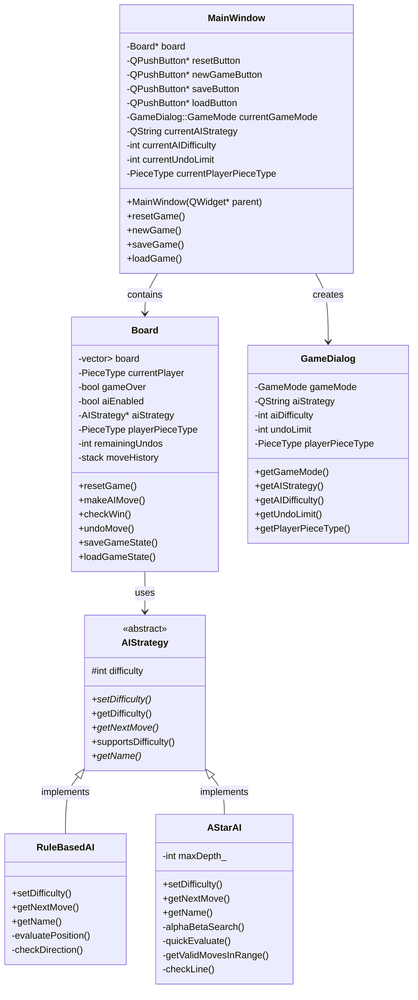
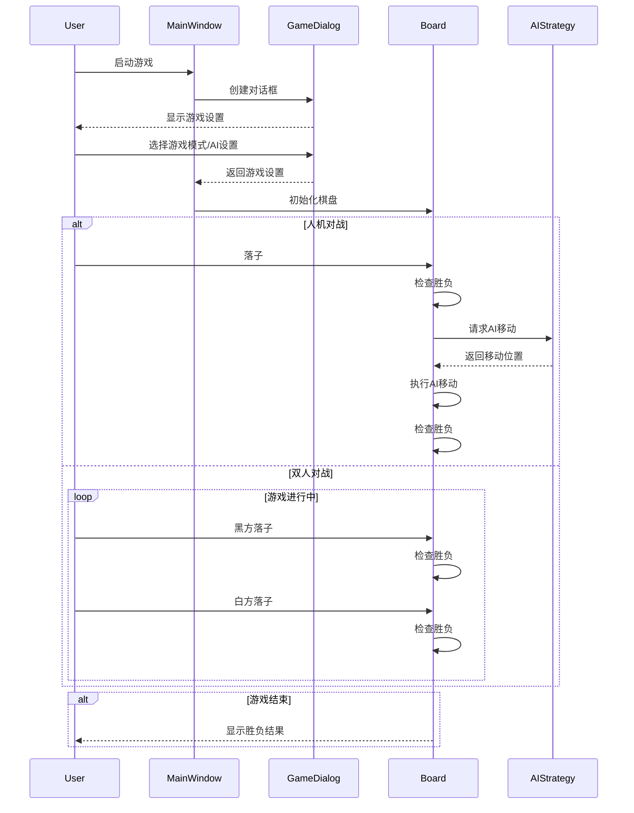
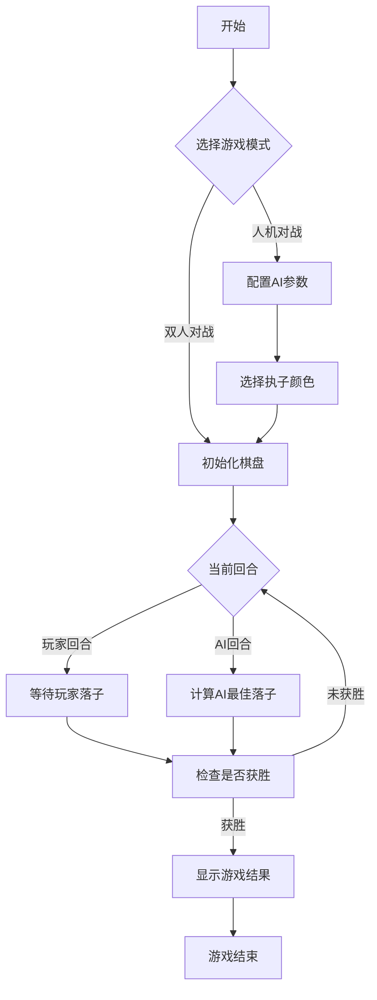

# AI五子棋游戏开发文档

## 项目简介

这是一个基于Qt框架开发的五子棋游戏，支持双人对战和人机对战模式。在人机对战模式中，实现了两种AI策略：规则基础AI和启发式搜索AI（A*算法）。游戏提供了多种功能，包括选择执子颜色、调整AI难度、悔棋、保存/加载游戏等。

## 技术栈

- 开发语言：C++17
- GUI框架：Qt 6
- 构建工具：CMake 3.16+
- 开发环境：支持Windows/Linux/MacOS

## 系统架构

### 整体架构

游戏采用经典的MVC架构设计：
- Model：棋盘状态、游戏逻辑、AI策略
- View：游戏界面、对话框
- Controller：用户输入处理、游戏流程控制

### 核心类设计

1. **MainWindow类**
   - 主窗口类，负责整体界面布局
   - 管理游戏控制按钮（新游戏、重置、保存、加载）
   - 协调Board和GameDialog的交互

2. **Board类**
   - 核心游戏逻辑类
   - 维护棋盘状态
   - 处理落子逻辑
   - 胜负判定
   - 与AI策略交互
   - 实现悔棋功能
   - 处理游戏存档

3. **GameDialog类**
   - 游戏设置对话框
   - 配置游戏模式（双人/人机）
   - 设置AI参数（策略、难度）
   - 选择执子颜色
   - 设置悔棋次数

4. **AIStrategy类**
   - AI策略抽象基类
   - 定义AI接口
   - 提供难度调整功能
   - 派生出具体的AI实现

5. **RuleBasedAI类**
   - 基于规则的AI实现
   - 使用评分系统进行落子决策
   - 考虑基本的进攻和防守策略

6. **AStarAI类**
   - 基于启发式搜索的AI实现
   - 使用Alpha-Beta剪枝
   - 实现高级评估函数
   - 支持可调深度的搜索

## 类图



## 时序图



## 流程图



## 主要功能

### 1. 游戏模式
- 双人对战：两名玩家轮流落子
- 人机对战：玩家与AI对战，支持选择执黑/执白

### 2. AI系统
- 规则基础AI：基于评分规则的简单AI
- 启发式搜索AI：使用A*算法的高级AI
- 可调难度：1-5级
- 动态评估：综合考虑进攻和防守

### 3. 游戏控制
- 悔棋功能：可设置悔棋次数限制
- 保存/加载：支持游戏进度保存
- 重新开始：随时重置当前游戏
- 新游戏：可重新配置游戏参数

### 4. 界面功能
- 最后落子标记
- 获胜连线显示
- 友好的游戏结果提示
- 直观的操作按钮

## AI策略详解

### 规则基础AI
1. 评分系统
   - 连五：100000分
   - 活四：10000分
   - 冲四：1000分
   - 活三：1000分
   - 眠三：100分
   - 活二：100分
   - 眠二：10分

2. 决策流程
   - 扫描所有可落子位置
   - 计算每个位置的综合得分
   - 选择得分最高的位置落子

### 启发式搜索AI
1. 核心算法
   - 使用Alpha-Beta剪枝的极大极小搜索
   - 动态搜索深度（根据难度调整）
   - 启发式评估函数

2. 优化策略
   - 限制搜索范围
   - 威胁判断
   - 棋型识别
   - 位置价值评估

3. 性能调优
   - 缓存评估结果
   - 优化搜索顺序
   - 合理的时间控制

## 开发规范

### 代码规范
1. 命名规范
   - 类名：大驼峰命名
   - 函数名：小驼峰命名
   - 变量名：小驼峰命名
   - 常量：全大写+下划线

2. 注释规范
   - 类注释：说明类的功能和职责
   - 函数注释：说明参数、返回值和功能
   - 关键算法注释：说明实现思路

3. 文件组织
   - 头文件：声明接口
   - 源文件：实现细节
   - 模块化组织

### 版本控制
- 使用Git管理代码
- 遵循Git Flow工作流
- 清晰的提交信息

### 构建系统
- 使用CMake构建
- 支持跨平台编译
- 管理依赖关系

## 未来展望

1. 功能扩展
   - 网络对战功能
   - 更多AI策略
   - 棋谱回放
   - 排行榜系统

2. 性能优化
   - AI算法优化
   - 界面响应优化
   - 内存使用优化

3. 用户体验
   - 自定义主题
   - 音效系统
   - 动画效果
   - 教程模式

## 安装说明

1. 环境要求
   - Qt 6.0+
   - CMake 3.16+
   - C++17兼容的编译器

2. 构建步骤
```bash
mkdir build
cd build
cmake ..
cmake --build .
```

3. 运行
```bash
./AIGomokuGame
```

## 贡献指南

1. Fork项目
2. 创建特性分支
3. 提交更改
4. 推送到分支
5. 创建Pull Request

## 许可证

本项目采用MIT许可证。详见LICENSE文件。 